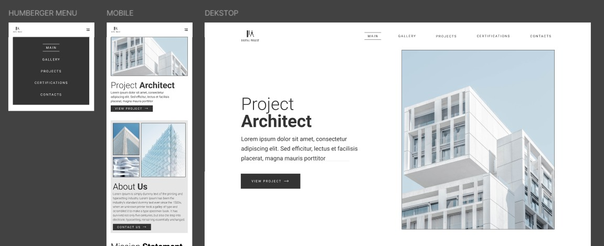

# Landing Page Responsive - Project Pembelajaran

Project ini adalah latihan pembuatan landing page responsif berdasarkan desain dari [Figma template Website of Architects](https://www.figma.com/design/r59WwQWlaE93OP8uIKukVJ/Website-of-architects---free-website--Community-?node-id=554-313&t=zTpmT9YTUkqf6FpO-1).

## Preview

## Struktur File

Project ini terdiri dari tiga file utama:

- `index.html` - Struktur HTML dengan komentar untuk setiap bagian yang harus dibuat
- `style.css` - CSS dengan reset/normalize dan kerangka untuk setiap komponen
- `script.js` - JavaScript dengan fungsi untuk mengonfirmasi koneksi dan kerangka fungsionalitas

## Komponen Utama

Landing page ini mencakup komponen-komponen berikut:

- **Navbar** - Navigasi yang berubah menjadi hamburger menu di layar kecil
- **Hero** - Bagian utama dengan gambar besar dan tombol call-to-action
- **About Us** - Informasi tentang perusahaan atau produk
- **Mission Statement** - Pernyataan misi organisasi
- **Our Projects** - Galeri atau daftar proyek yang telah dikerjakan
- **Contact Us** - Formulir kontak dan informasi hubungan
- **Footer** - Informasi tambahan, tautan sosial, dan copyright

## Fitur Responsif

- Desain yang sepenuhnya responsif untuk semua ukuran layar
- CSS Reset untuk konsistensi lintas-browser
- Media queries untuk tampilan optimal di desktop, tablet, dan mobile
- Navigasi hamburger untuk perangkat mobile
- Gambar yang diskalakan secara responsif

## Cara Menggunakan

1. Clone atau download repository ini
2. Buka `index.html` di browser untuk melihat struktur dasar
3. Mulai mengembangkan setiap komponen sesuai dengan komentar yang disediakan
4. Gunakan `style.css` untuk menambahkan gaya sesuai desain Figma
5. Gunakan `script.js` untuk menambahkan fungsionalitas interaktif

## Teknologi yang Digunakan

- HTML5
- CSS3 (termasuk Flexbox/Grid)
- JavaScript ES6+
- Responsive Design (Media Queries)

## Kontribusi

Project ini dimaksudkan sebagai latihan pembelajaran, namun Anda dipersilakan untuk berkontribusi dengan membuat pull request.
